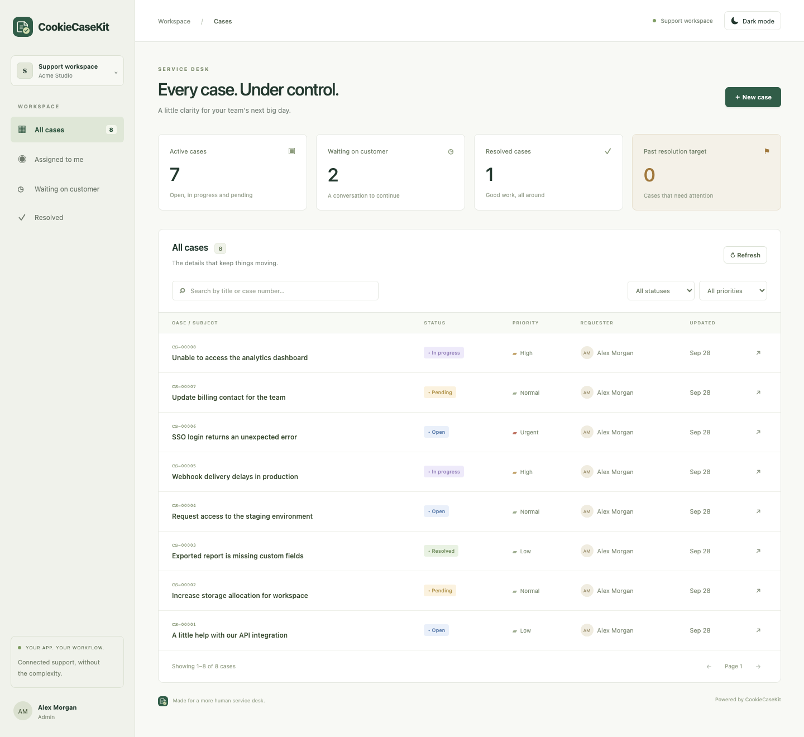
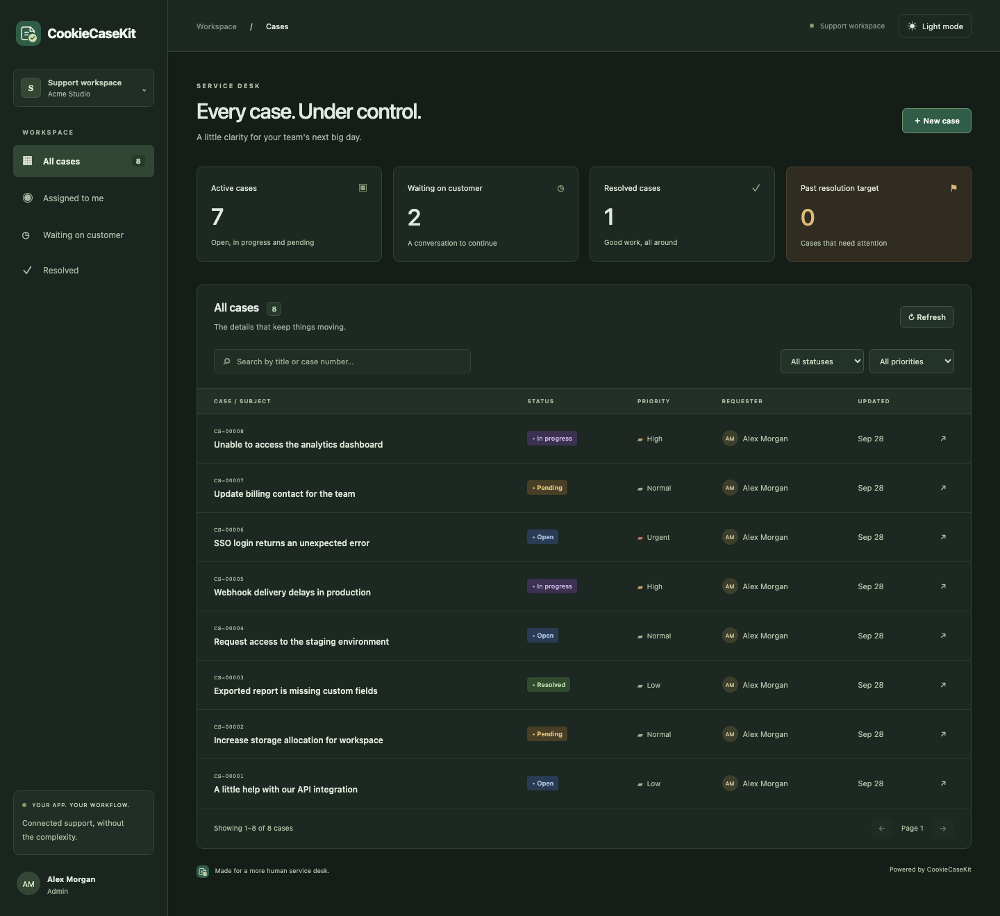
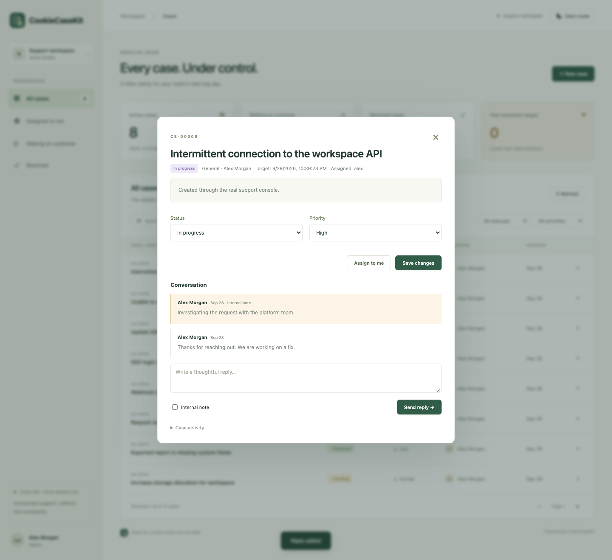

# CookieCaseKit

**An embeddable service desk for your Node.js application.**

Configure a database, connect your existing authentication, and mount a complete case-management UI and REST API. No separate frontend build, identity provider, or hosted service is required.



## What you get

- Cases with priorities, categories, assignment, status transitions, and resolution targets.
- Responsive agent console and requester portal, with search, filters, pagination, and case statistics.
- Public replies, private staff notes, and staff-only case history.
- Requester, agent, and admin authorization with tenant isolation.
- Persistent SQLite storage and automatic initial schema creation.
- Optional SMTP notifications with a durable retry queue and IMAP replies added as public case notes.
- Light and dark themes with a remembered preference and a shared SVG brand mark.
- TypeScript declarations, ESM and CommonJS exports, and a standard Node HTTP handler.
- CI, package verification, browser tests, CodeQL, dependency updates, and automated release PRs.

CookieCaseKit is an initial ticketing product, inspired by service-desk workflows. It is not a ServiceNow replacement: CMDB, attachments, business-hours SLA calendars, custom automation designers, and PostgreSQL/MySQL adapters are not included.

## Cloud deployments in 1.0.0

The new asynchronous `cookiecasekit/cloud` API supports adapters for **Firestore, PostgreSQL, DynamoDB and Cosmos DB**, with private attachment storage for **Google Cloud Storage, AWS S3 and Azure Blob Storage**. SQLite remains available for a single persistent Node process.

Cloud deployments include explicit scheduled email processing, atomic outbox writes, retry-safe case creation, concurrent-worker leases, verified host identities, and React bearer-token integration. Optional email adapters cover SMTP, Amazon SES and Azure Communication Services. Attachments remain quarantined until your trusted malware scanner approves them.

See the [cloud integration guide](docs/cloud/README.md) for installation, database schemas, identity setup, security requirements, worker invocation, deployment limits, and provider verification requirements. These cloud additions are being prepared for 1.0.0; live-provider checks are a release gate, not implied by local test results.

```ts
import { createCloudTicketing } from 'cookiecasekit/cloud';
import { firestoreStore } from 'cookiecasekit/firestore';

const caseKit = createCloudTicketing({
  store: firestoreStore(firestore),
  auth: verifiedHostIdentity,
  categories: contactTopics,
});
app.use('/api/support', caseKit.router);
const ticket = await caseKit.createCase(input, requester, { idempotencyKey: submissionId });
```

In a Firebase/Cognito/Entra React host, render `<CaseKit basePath="/api/support" getToken={getFreshToken} />`. The server verifies the token; frontend roles never grant access.

## Node package + React page (recommended)

Call `caseKit.createCase(input, requester)` directly from your existing Node handler or server action. No custom REST endpoint is needed. Mount the package's authenticated router once, then render your own React `/support` page:

```tsx
import { CaseKit } from 'cookiecasekit/react';
import 'cookiecasekit/react.css';

export default function SupportPage() {
  return <CaseKit basePath="/_casekit" />;
}
```

Use `ui: false` and `app.use('/_casekit', caseKit.router)` on the server. The package supplies the browser transport; your session callback supplies the admin name and access. See the [complete Node + React integration](docs/REACT.md).

## Run the demo

Requires **Node.js 22.13+**; Node 24 is recommended. Node's built-in SQLite API may emit an experimental warning on supported Node releases.

```sh
npm ci
npm run demo
```

Open **http://127.0.0.1:3000/support/**. The demo seeds eight cases, uses an in-memory database, and signs you in as a demonstration admin. It binds only to localhost. Set `DEMO_DB=./demo.db` to persist the demo, or `PORT=3001` to change its port. Never deploy the demo's fixed identity as real authentication.

## Install into an application

Install the published package with `npm install cookiecasekit`. To test the 1.0.0 release checkout before publication, use a local archive:

```sh
# In this repository
npm ci
npm pack

# In your host application (adjust the path)
npm install /path/to/cookiecasekit-1.0.0.tgz
```

After publishing, consumers can use `npm install cookiecasekit` (or your chosen scoped name).

```ts
import express from 'express';
import { createTicketing } from 'cookiecasekit';

const app = express();
// app.use(yourExistingAuthenticationMiddleware);

const support = createTicketing({
  database: { filename: './support.db' },
  auth: (req) => {
    // `req.user` must come from your verified session/JWT middleware.
    // Map your application's user fields to this identity contract.
    const user = req.user;
    if (!user) return null;
    return {
      id: user.id,
      name: user.name,
      email: user.email,
      role: user.supportRole, // 'requester' | 'agent' | 'admin'
      tenantId: user.organizationId,
    };
  },
  brand: { name: 'Acme Support', accent: '#315d48' },
  categories: ['General', 'Billing', 'Engineering'],
  slaHours: { urgent: 4, high: 24, normal: 72, low: 168 },
  email: {
    from: 'support@example.com',
    publicUrl: 'https://your-app.example/support',
    transport: {
      host: process.env.SMTP_HOST,
      port: 587,
      secure: false,
      requireTLS: true,
      auth: { user: process.env.SMTP_USER, pass: process.env.SMTP_PASSWORD },
    },
  },
});

app.use('/support', support.router);
const server = app.listen(3000);
process.once('SIGTERM', () => {
  server.close(() => {
    void support.close();
  });
});
```

Your host defines the `req.user` TypeScript augmentation. See [the typed integration example](examples/express.ts). Omit `email` entirely to disable notifications. The integration requires mounting the package and mapping your identity once; workflows and UI then run from configuration.

For CommonJS: `const { createTicketing } = require('cookiecasekit')`.

### Other Node HTTP applications

Use `support.handler` with `node:http` or an HTTP middleware adapter. It is a complete Express application, so it supplies the request/response helpers the router requires:

```ts
import { createServer } from 'node:http';
import { createTicketing } from 'cookiecasekit';
const support = createTicketing({
  database: { filename: './support.db' },
  auth: async (req) => verifyYourSession(req), // Your own implementation; return User or null.
});
const server = createServer(support.handler);
server.listen(3000); // UI at /, API at /api
```

For Fastify, Nest, or other frameworks, use their Express/Node HTTP adapter or mount this as a sidecar route. Framework-specific adapters and edge runtimes are not included. Keep the console and API on the same origin as your host authentication.

## Optional HTTP contact-form example

If your website needs a new HTTP submission endpoint, use the [contact-form integration guide](docs/CONTACT-US.md) and [tested server example](examples/contact-us.ts). Visitors post to `/api/contact`; your backend calls `support.createCase()` and returns only a reference number. `/support` remains restricted to your authenticated users with support permission. Their names come from your existing session, mapped to `User.name`. Omit `email.publicUrl` to avoid linking visitor emails to the private console.

## Configuration

Set `ui: false` when React owns the support page. The default `ui: true` also serves the standalone console.

| Setting                        | Default / behavior                                                                                            |
| ------------------------------ | ------------------------------------------------------------------------------------------------------------- |
| `database.filename`            | Required. SQLite file path; `:memory:` for tests. Parent directory must exist.                                |
| `auth(req)`                    | Required. Sync/async verified `User` or `null`; anonymous requests receive 401.                               |
| `User`                         | Non-empty `id`, `name`, `email`, `tenantId`, and `role`. Roles and tenant IDs must be derived by your server. |
| `brand.name` / `brand.accent`  | `CookieCaseKit` / `#315d48`. Accent must be a six-digit hex color.                                            |
| `categories`                   | General, Access & identity, Infrastructure, Billing, Product.                                                 |
| `slaHours`                     | Low 168, normal 72, high 24, urgent 4; partial overrides accepted.                                            |
| `email.from`                   | Bare sender email address. Required when email is enabled.                                                    |
| `email.transport`              | Nodemailer SMTP transport configuration.                                                                      |
| `email.publicUrl`              | Optional externally accessible URL of the mounted console, used in case links.                                |
| `email.pollIntervalMs`         | 30,000; minimum 1,000.                                                                                        |
| `logger.error(message, error)` | `console.error`; provide a redacting application logger if needed.                                            |

`createTicketing()` returns `router`, `handler`, `createCase(input, requester)`, `flushEmails()`, `pollInbox()`, `receiveEmail(rawMessage)` and async `close()`. Call `close()` during graceful shutdown after HTTP requests finish. It waits for in-flight notification delivery, inbox polling and email ingestion before closing storage.

## Add or change categories

Set `categories` in your host configuration and restart the service. The API and the UI dropdown use the same list; no frontend edits or database migration are needed.

```ts
const support = createTicketing({
  database: { filename: './support.db' },
  auth: (req) => req.user ?? null, // Your verified User mapping.
  categories: [
    'General',
    'Access & identity',
    'Infrastructure',
    'Billing',
    'Product',
    'HR',
    'Finance',
    'Facilities', // Add your own here.
  ],
});
```

The array replaces the defaults. Include defaults you want to keep. Use 1–50 unique, non-empty category names, each at most 80 characters. Existing cases retain their category if it is later removed; creating a case or explicitly changing its category must use a configured value.

## Light and dark mode

Use the theme button in the top bar. The initial theme follows the browser's system preference, and an explicit choice is saved in local storage. Both modes cover the case list, forms, conversations and private notes, including on mobile. Theme changes do not affect your data or authentication.



## Access model

| Capability                                      | Requester | Agent                      | Admin            |
| ----------------------------------------------- | --------- | -------------------------- | ---------------- |
| Create a case, view stats, search               | Own cases | Tenant cases               | Tenant cases     |
| Read / reply                                    | Own cases | Tenant cases               | Tenant cases     |
| Read / add internal notes and read audit events | No        | Yes                        | Yes              |
| Change status, priority, category               | No        | Yes                        | Yes              |
| Assignment                                      | No        | Claim self / unassign self | Any host user ID |
| Cross-tenant access                             | No        | No                         | No               |

New cases always belong to the authenticated user and tenant. Caller-supplied ownership fields are ignored. Admin assignment accepts an opaque host user ID; the host remains responsible for valid agent identities. The UI supports claiming cases; admin assignment to another ID is available through the API.

## API

All paths are relative to your mount point (for example `/support`). Authentication runs on **every** request, including static UI files. Write requests must use `Content-Type: application/json` and `X-CookieCaseKit: 1`. The package does not enable CORS; do not enable permissive credentialed CORS in the host.

| Method | Path                      | Purpose                                                                           |
| ------ | ------------------------- | --------------------------------------------------------------------------------- |
| GET    | `/api/me`                 | Identity and safe UI configuration                                                |
| GET    | `/api/stats`              | Scoped total, active, pending, resolved and overdue counts                        |
| GET    | `/api/cases`              | Paginated list: `q`, `status`, `priority`, `assignee=me`, `page`, `limit` (1–100) |
| POST   | `/api/cases`              | Create: `title`, `description`, optional `priority`, `category`                   |
| GET    | `/api/cases/:id`          | Case, visible comments and authorized history                                     |
| PATCH  | `/api/cases/:id`          | Agent/admin update; requires current `version`                                    |
| POST   | `/api/cases/:id/comments` | `{ "body": "...", "internal": false }`                                            |

An update is `{ "version": 1, "status": "in_progress", "priority": "high", "assigneeId": "agent-id" }`. `category` is also editable; `assigneeId: null` clears assignment. A stale version returns **409**: fetch the current case, review changes, then retry. Comments also increment the case version.

Statuses follow these transitions (setting the current status is also allowed):

```text
open        → in_progress | pending | resolved
in_progress → open | pending | resolved
pending     → open | in_progress | resolved
resolved    → open | closed
closed      → open
```

Errors are JSON `{ "error": "message" }` with 400 (validation), 401 (authentication), 403 (authorization/write guard), 404 (missing or inaccessible case), 409 (conflict), 413 (payload), or 500 (generic internal error). Lists return `{ items, total, page, limit }`; timestamps are ISO UTC strings.

## Email, storage and operations

Creation, status changes, and public replies from another user enqueue notifications to the requester. Internal notes never generate email. Notifications are committed in the same transaction as the case change, retried with exponential backoff, and stop after five failed deliveries. Delivery is at least once: a crash after SMTP accepts a message can cause a duplicate. See [operations](docs/OPERATIONS.md) for queue inspection and recovery.

### Turn email replies into case notes

**Yes: creating a case queues an email to its requester when SMTP is configured.** Delivery is asynchronous (normally within the 30-second worker interval), with retries on failure. The development demo has no real email transport configured.

SMTP sends mail; it does not read replies. Add a dedicated IMAP mailbox to read incoming replies automatically:

```ts
email: {
  from: 'support@example.com',
  replyTo: 'replies@example.com', // This address must deliver to the IMAP mailbox below.
  publicUrl: 'https://your-app.example/support',
  transport: {
    host: process.env.SMTP_HOST, port: 587, secure: false, requireTLS: true,
    auth: { user: process.env.SMTP_USER, pass: process.env.SMTP_PASSWORD },
  },
  inbound: {
    connection: {
      host: process.env.IMAP_HOST, port: 993, secure: true,
      auth: { user: process.env.IMAP_USER, pass: process.env.IMAP_PASSWORD },
    },
    mailbox: 'INBOX',
    pollIntervalMs: 30_000,
  },
}
```

The requester clicks **Reply** to a notification whose subject contains `[CS-00001]`. CookieCaseKit matches the case number, requester address, and a random outgoing `Message-ID` preserved in `In-Reply-To` or `References`. The reply appears as a **public note labeled Email reply**, with an audit event and a new case version. The case status is unchanged.

A case ID alone does not authorize a note. Wrong senders, unrelated thread references, ambiguous case IDs, automatic replies and duplicates are rejected or ignored. Only requester replies are accepted; staff should use the authenticated console to post notes. Replies cannot create internal notes. Keep anti-spoofing/spam controls enabled on the receiving mailbox: thread correlation is an additional safeguard, not a replacement for your mail provider's authentication checks.

Polling uses durable mailbox UID cursors, processes up to 25 messages per cycle, and leaves mailbox flags and message content unchanged. Duplicate `Message-ID`s are ignored even after restart. Typical top-posted text is extracted; HTML mail is converted to plain text. Attachments are not imported. Messages over 1 MiB or reply bodies over 10,000 characters are ignored and reported to the configured logger. Use a dedicated mailbox; the first poll also examines existing messages in it.

For an inbound-email provider/webhook instead of IMAP, your server can call `await support.receiveEmail(rawRfc822Message)` **after verifying the provider request**. It returns `{ status: 'accepted' | 'duplicate', caseId, commentId }` or `{ status: 'ignored', reason }`. No public webhook is exposed by this package. `pollInbox()` triggers an immediate IMAP pass; `flushEmails()` triggers a notification pass.

Existing schema-v1 databases migrate automatically to v2. Replies to old notifications sent before this upgrade cannot be matched because their random email thread IDs were not stored. Notifications sent after upgrading, including previously queued messages, support reply matching.

SLA targets are elapsed hours from case creation, not business hours. A priority change recalculates the target from the original creation time. Pending cases do not pause it; reopened cases retain it. Resolved and closed cases do not count as overdue.

The SQLite adapter supports **one application process per SQLite file**, on persistent local disk. It is not designed for horizontally scaled workers sharing one file or ephemeral serverless filesystems. Tenant records share the same physical database with application-level isolation. Use separate instances/files if physical isolation is required.

## Develop and release

```sh
npm run check           # Type check, API integration tests, ESM/CJS build
npm run test:package    # Install packed archive in a fresh app; exercise both formats and UI assets
npx playwright install chromium
npm run test:ui         # Browser flows and mobile layout
npm run screenshots    # Refresh the actual demo screenshots
npm pack               # Publishable archive (builds automatically)
```

See [publishing setup](docs/PUBLISHING.md), [contributing](CONTRIBUTING.md), and [security](SECURITY.md). The release workflow opens a version/changelog PR from Conventional Commits; merging it creates a GitHub release and publishes to npm using the `NPM` Actions secret and to GitHub Packages using `GITHUB_TOKEN`. The weekly job refreshes release PRs when releasable changes exist. It does not publish empty weekly versions or auto-merge dependencies.

## UI preview



MIT licensed. Built with [Express](https://expressjs.com/en/guide/using-middleware/), [Node SQLite](https://nodejs.org/api/sqlite.html), and [Nodemailer SMTP](https://nodemailer.com/smtp).

### Publish your first release

The Node method and React `/support` integration are documented above and in the [integration guide](docs/REACT.md).

With your **`NPM`** Actions secret configured, push the tested source and publish a GitHub release tagged **`v0.1.0`** at that commit. The **Publish tagged release** action validates the release/tag/version, runs checks, and publishes:

- **npm:** `cookiecasekit` — install with `npm install cookiecasekit`.
- **GitHub Packages:** `@jaberk90/cookiecasekit` — linked to this repository's Packages section. npm publication alone does not populate that section. Set the GitHub package's visibility to public in its settings if desired.

Subsequent releases follow the version/changelog PR flow. Failed or partial publications can be retried from **Actions → Publish tagged release** with the existing release tag; published versions are skipped. See [publishing setup](docs/PUBLISHING.md) for token permissions, first-release steps, GitHub registry installation, and release PR setup.

### Stable 1.0.0 release

The 1.0.0 API supports direct Node case creation and a native React support page. SQLite deployment remains limited to one process per persistent file; managed cloud adapters support concurrent application instances. SMTP/IMAP credentials, verified host authentication, HTTPS and rate limits are host configuration responsibilities.

Security automation runs nightly, including weekends, with Dependabot PRs for dependency upgrades and available vulnerability fixes. See [the security policy](SECURITY.md) for schedules and limitations. After merging the tested 1.0.0 release PR, publish a stable GitHub release tagged `v1.0.0` at that merge commit to trigger registry publication.
