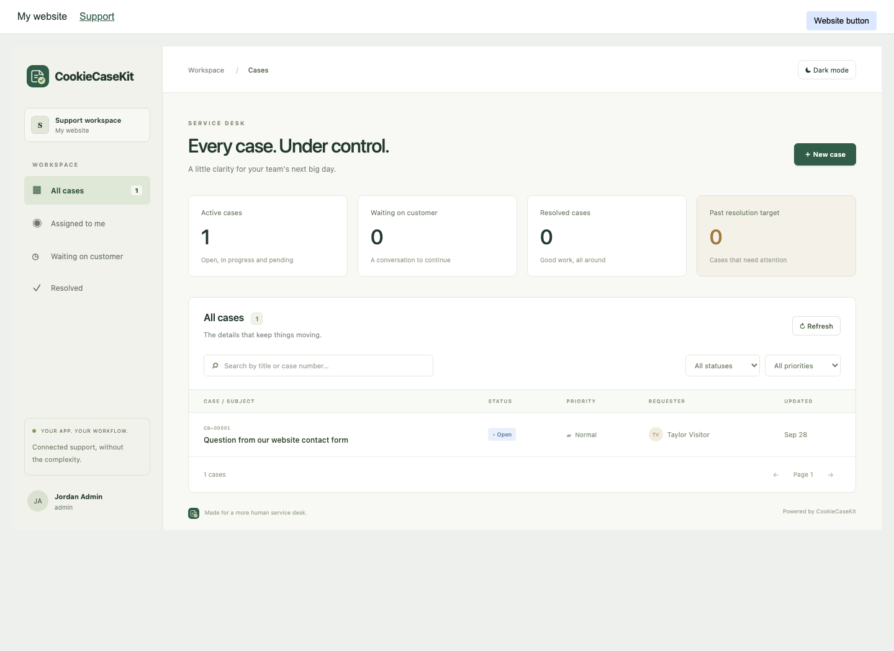

# Use CookieCaseKit as a Node package and a React page

Your Node application calls package methods directly. Your React application renders the `CaseKit` component. You do not need to create custom REST endpoints for case management or call your own backend over HTTP from Node.

The browser still communicates with Node to load and change cases. CookieCaseKit supplies that authenticated transport through its router; mount it once. Database credentials, SMTP/IMAP configuration and authorization stay in Node.

## 1. Configure one server instance

```ts
// server/case-kit.ts — Node only, never import this file from browser components.
import { createTicketing } from 'cookiecasekit';

export const caseKit = createTicketing({
  database: { filename: './support.db' },
  ui: false, // Your React app owns /support; disable the standalone HTML console.
  categories: ['General', 'Contact', 'Billing', 'Technical'],
  auth: (req) => {
    const user = req.user; // Verified by your existing session middleware.
    if (!user?.permissions?.includes('support:access')) return null;
    return {
      id: String(user.id),
      name: user.fullName,
      email: user.email,
      role: 'admin',
      tenantId: 'my-website',
    };
  },
  // email: { from, replyTo, transport, inbound }
});
```

Map `req.user` to your own server's user fields and TypeScript augmentation. The callback is the backend access check. The admin's name appears in the profile and on their notes. Do not supply roles or a trusted identity from React props.

Mount the router after your existing authentication/session middleware, before any SPA fallback route:

```ts
import { caseKit } from './case-kit.js';
app.use(yourExistingSessionMiddleware);
app.use('/_casekit', caseKit.router);
// Your existing React/static hosting and /support route remain owned by your application.
```

Both `/_casekit/api/*` and your `/support` route should live on the same origin. For Vite development, proxy `/_casekit` to your Node server. Your normal host route guard can redirect unauthorized navigation to login; the backend callback independently rejects unauthorized requests.

## 2. Create a case with a direct method call

Use this in your **existing** contact-form handler, server action, job, or service:

```ts
import { randomUUID } from 'node:crypto';
import { caseKit } from './case-kit.js';

const ticket = caseKit.createCase(
  {
    title: form.subject,
    description: form.message,
    category: 'Contact',
    priority: 'normal',
  },
  {
    id: `contact:${randomUUID()}`,
    name: form.name,
    email: form.email,
    tenantId: 'my-website',
  },
);
// Return ticket.number from your existing form flow, e.g. CS-00001.
```

This is an in-process database operation with validation and transactional email queueing. It does not make a REST request and does not require a new `/api/contact` route. Keep your existing form validation/spam protection. The server controls the tenant and requester ID; a visitor's submitted name/email are contact details, not login credentials.

`createCase()` is server-only. A browser cannot call a Node/database method without a server boundary; your current form handler or framework's server action supplies that boundary. No database or mail configuration belongs in React.

## 3. Render the package in your React /support page

```tsx
'use client';
import { CaseKit } from 'cookiecasekit/react';
import 'cookiecasekit/react.css';

export default function SupportPage() {
  return <CaseKit basePath="/_casekit" />;
}
```

Register `SupportPage` at `/support` using your existing React router. This is a native React component, not an iframe. It includes case search, filters, statistics, creation, assignment, status/priority updates, public replies, private notes, history, and light/dark mode.

The browser component imports no SQLite, SMTP or IMAP code. Styles are scoped under `.cck`; the theme stays on the component root and does not change your document's theme. The component uses the existing same-origin session cookie. The backend supplies the user's name and permissions after checking that cookie.

For Next or another framework that restricts global CSS imports, import `cookiecasekit/react.css` in the app layout/stylesheet entry instead. A framework-specific backend adapter is not supplied: this example assumes an Express/Node HTTP middleware mount. Serverless/edge runtimes and ephemeral database storage are not supported.

### Component props

| Prop             | Default     | Purpose                                                                   |
| ---------------- | ----------- | ------------------------------------------------------------------------- |
| `basePath`       | `/_casekit` | Same-origin path where the Node router is mounted; must match the server. |
| `className`      | Empty       | Optional class on the component root for layout integration.              |
| `onUnauthorized` | None        | Callback on backend 401; use your app's router to navigate to login.      |

The component follows system theme initially and remembers explicit light/dark selections. If you use an `onUnauthorized` callback from a Server Component framework, pass it from a client wrapper. Host React 18.2+ and React 19 are supported; React is an optional peer so server-only applications do not need it.

## Try the embedded demo



```sh
npm ci
npm run build
npm run demo:react
```

Open **http://127.0.0.1:3001/support**. The demo renders CaseKit inside a host website page and seeds a case via a direct method call. Its fixed admin identity is for localhost demonstration only. Your existing standalone demo at port 3000 remains separate.

Call `caseKit.close()` when shutting down after requests drain. Configure email as described in the README; omit `email.publicUrl` if customer emails must not link to the private admin page.

## Cloud authentication

Pass `getToken={() => currentUser.getIdToken()}` for Firebase, or the equivalent fresh-token function from your Cognito/Entra host. Each request resolves the current token and sends it in Authorization. The host backend must verify it. For cookie sessions, omit `getToken`. Cloud setup and private attachments are documented in [the cloud guide](cloud/README.md).

### Match your application's theme

In 1.0.1, pass `theme="dark"` or `theme="light"` and `onThemeChange={setTheme}` to synchronize the embedded console with your host theme. Without `onThemeChange`, a controlled theme hides the local toggle. Omit both props to retain the independent, persisted theme preference.
